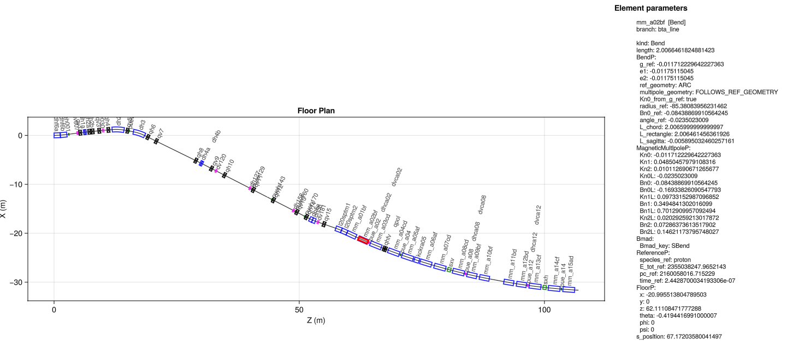
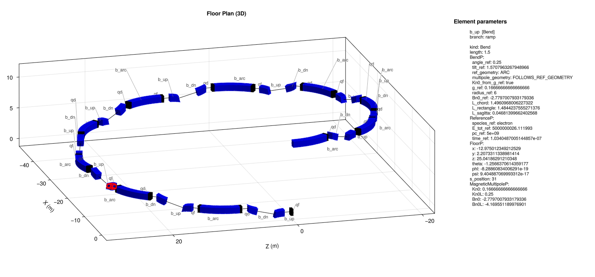

# AcceleratorLatticePlot.jl

[](https://github.com/pals-project/AcceleratorLatticePlot.jl/actions/workflows/test.yaml)

Floor-plan plotting for [PALS](https://github.com/campa-consortium/pals) lattices,
built on [PALSJulia](https://github.com/pals-project/PALSJulia.jl) and
[Makie](https://docs.makie.org/stable/).

Given the expanded lattice from `PALSJulia.parse_and_expand_pals`,
AcceleratorLatticePlot draws the machine either **projected onto a plane**
(`floor_plot`) or as **solids in three dimensions** (`floor_plot3`). Each element
is rendered as a shape — sized, colored and labeled by a
[Tao](https://www.classe.cornell.edu/bmad/)-style rule table — placed and
oriented from the floor coordinates the expander computes (the `full_expanded`
view; see [Which expanded view](#which-expanded-view)). Bends follow their true
arc. Both windows support **pan**, **zoom**, and **click-to-inspect**: click an
element and its full parameter set is listed in a side panel.



*`floor_plot` on the `bta` line, with one bend clicked: the panel lists that
element's parameters as the expander left them, its `FloorP` and `s_position`
included.*

The two views are the same drawing. They share the shape table and the placement
math, and the 3D drawing extrudes the very profile the floor plan strokes, so
looking straight down at `floor_plot3` gives you `floor_plot`.

It is designed to stay responsive on machines with tens of thousands of elements:
the entire lattice is drawn with a handful of batched Makie calls (2D: one for
all element outlines, one for all interior strokes, one for the reference orbit,
one for the labels; 3D: one mesh for every solid in the machine) rather than one
plot object per element, and element labels use level-of-detail so they appear
only when the view is zoomed in far enough.

## Installation

AcceleratorLatticePlot depends on PALSJulia, which is a wrapper around the
`yaml_c_wrapper` C library shipped with
[pals-cpp](https://github.com/pals-project/pals-cpp). Clone all three side by
side and build the C library first:

```
some-dir/
  pals-cpp/       # build this first: cmake -S . -B build && cmake --build build
  PALSJulia/
  AcceleratorLatticePlot/
```

Then, from the `AcceleratorLatticePlot` directory:

```console
julia --project=. -e 'using Pkg; Pkg.develop(path="../PALSJulia"); Pkg.instantiate()'
```

### Choosing a backend

AcceleratorLatticePlot depends on **Makie**, not on any one Makie backend: every
drawing call it makes is Makie core, and a backend is needed only to put the
figure somewhere. So you add the one you want.

```console
julia --project=. -e 'using Pkg; Pkg.add("GLMakie")'      # interactive window
julia --project=. -e 'using Pkg; Pkg.add("CairoMakie")'   # write PDF/PNG/SVG
```

Loading a backend activates it, so `using GLMakie` is all it takes. The
extraction and geometry stages, and building a `Figure`, need no backend at all.

## Quick start

```julia
using PALSJulia
using AcceleratorLatticePlot
using GLMakie

lat = parse_and_expand_pals("machine.pals.yaml")
fp  = floor_plot(lat)
display(fp)              # opens an interactive window

fp3 = floor_plot3(lat)   # ...or the same machine in 3D
display(fp3)
```

or, with no display available, render straight to a file:

```julia
using CairoMakie
save("floor.pdf", floor_plot(lat).figure)
```

or run the bundled examples:

```console
julia --project=. examples/floor_plan.jl    path/to/machine.pals.yaml
julia --project=. examples/floor_plan_3d.jl path/to/machine.pals.yaml
```

`examples/helix.pals.yaml` is a small lattice bundled here to have something
that leaves the horizontal plane to point them at; see [3D
drawing](#3d-drawing).

**Controls**

| gesture | 2D (`floor_plot`) | 3D (`floor_plot3`) |
|---|---|---|
| scroll wheel | zoom in/out at the cursor | zoom |
| left-drag | rubber-band zoom to a rectangle | orbit |
| **right-drag** | pan | pan |
| `ctrl` + **left**-click | reset to the full view | reset to the full view |
| `ctrl` + `shift` + **left**-click | reset to limits recomputed from the data | — |
| left-click (no modifier) | select an element (lists its parameters in the side panel) | same |

Everything but selection is a Makie default `Axis`/`Axis3` binding. Makie has no
double-click binding, so **double-clicking does nothing** — `ctrl`-left-click is
the reset.

### Which expanded view

`parse_and_expand_pals` returns the expanded lattice twice.
AcceleratorLatticePlot reads **`lat.full_expanded`**, the view in which the
expander has computed every dependent parameter: each element's `FloorP`
(position and orientation at its upstream end), its `s_position`, and — for a
bend — the `BendP.angle_ref` the arc is drawn from. `lat.expanded` holds the same
lattice pruned back to what the author wrote, so none of that is in it and
nothing could be placed.

`full_expanded` also caps each branch with a zero-length `branch_end`
`Placeholder` holding the downstream end of the last element. It appears in the
element table like any other element; the default shape table draws it as bare
centerline.

### Build pals-cpp against libc++

AcceleratorLatticePlot needs the pals-cpp C library to be built with the **same
C++ runtime as Julia and Makie — LLVM libc++ (Apple clang)**. If pals-cpp is
instead built with GCC/libstdc++ (e.g. because `CC`/`CXX` point at MacPorts
GCC), then loading a Makie backend and then parsing a lattice file **aborts the
process** (signal 6): the two C++ exception runtimes clash in the library's file
reader.

Build pals-cpp with clang:

```console
cd pals-cpp && rm -rf build
env -u CC -u CXX cmake -S . -B build \
    -DCMAKE_C_COMPILER=/usr/bin/clang -DCMAKE_CXX_COMPILER=/usr/bin/clang++
cmake --build build
```

Verify with `otool -L build/libyaml_c_wrapper.dylib`: it should show
`/usr/lib/libc++.1.dylib` and **no** `libstdc++`.

## Choosing shapes

Element appearance is controlled by an ordered list of rules, each mapping an
`"<class>::<name-glob>"` to a shape, color, size and label — the first rule an
element matches wins, with a built-in default table appended:

```julia
shapes = ShapeMap([
    ele_shape("Quadrupole::q*", :xbox,   :black; size=0.6, label=:name),
    ele_shape("Bend",           :box,    :blue;  size=0.5),
    ele_shape("Wiggler",        :box,    :green; size=0.5),
])
floor_plot(lat; shapes=shapes)
```

The class is a PALS element kind (`Bend`, `Quadrupole`, `RFCavity`, `Fork`, …
from the standard's `lattice-element-kinds.md`), matched case-insensitively;
`"*"` matches any kind. The built-in table covers every kind a beam line can
hold, and anything else falls through to a small unlabeled box.

Available shapes: `:box`, `:xbox`, `:x`, `:bow_tie`, `:rbow_tie`, `:diamond`,
`:u_triangle`, `:d_triangle`, `:l_triangle`, `:r_triangle`, `:circle`, `:none`.
`size` is the horizontal transverse half-height in meters; `label` is `:name`,
`:s`, or `:none`. Pass `defaults=false` to `ShapeMap` to use only your own rules.

The same table drives the 3D drawing, where each shape is the 2D profile
extruded by `size2` — the vertical half-height, which defaults to `size` — either
side of the centerline. So `:box` is a rectangular prism, `:xbox` the same with
its X on the top and bottom faces, `:u_triangle` a triangular prism, and so on;
`:circle`, which the floor plan draws as a disc at the element's midpoint, is a
sphere, that being the solid whose silhouette is a disc from every direction and
not only from above.

Labels are drawn perpendicular to the centerline, running outward from the
element, and tilted only within ±90° so none of them come out upside down.
Elements are strung out *along* the line, so laying their labels across it is
what keeps neighbouring names from running into each other.

Elements that sit on top of each other — a pickup with its two correctors, say —
defeat that, since their labels share one anchor and one ray. Those are detected
and stacked along the ray instead, the element earliest in the branch keeping the
place nearest the centerline. `floor_plot(...; label_sep=…)` sets how close two
anchors have to be to count as colliding, in units of the elements' half-height;
`label_sep=0` turns the stacking off.

## Projection

`floor_plot(lat; view="zx")` selects the projection plane. `view` is a
two-character string of global axes (`x`, `y`, `z`): the first maps to the
horizontal screen axis, the second to the vertical. The default `"zx"` looks at
the horizontal plane from above. The axis aspect ratio is kept 1:1 so the drawing
is not distorted.

`floor_plot3(lat; view="zxy")` takes the same string with a third character, the
drawn vertical. The default `"zxy"` puts global `z` and `x` in the horizontal
plane with the global vertical `y` up, so looking straight down at it reproduces
the default floor plan. The aspect is `:data`, which is honest and, for a machine
that lies flat, leaves the box a pancake with a lot of empty frame around it;
`fp.axis.aspect[] = (1, 1, 0.4)` stretches the vertical if a diagram is what you
are after.

## 3D drawing

```julia
using GLMakie
fp = floor_plot3(lat)
display(fp)
```



*`examples/helix.pals.yaml`, a small lattice that exists to be three
dimensional: ten identical cells, each turning the beam 36° in the horizontal
plane and lifting it about 1.1 m, so the line closes on itself in plan and comes
back over its own start 11 m higher. The lift is `tilt_ref`'s doing — the
selected `b_up`, whose parameters are in the panel, is a Bend with `tilt_ref`
= π/2, which rolls its bend plane a quarter turn about the beam axis so that it
bends vertically instead of horizontally. This is the lattice a floor plan
cannot show: projected onto the horizontal plane the ten cells lie on top of
each other, as one circle.*

```console
julia --project=. examples/floor_plan_3d.jl examples/helix.pals.yaml
```

GLMakie is the backend this is meant for. CairoMakie will render a 3D figure —
the tests do — but it depth-sorts whole primitives rather than pixels, so a
machine-sized mesh comes out with sorting artifacts. Use it for a quick still,
not for looking at a machine.

Two things work differently from the floor plan, both because a 3D view is not
just a floor plan with an extra axis:

* **Picking.** The floor plan finds the element nearest the cursor in data
  coordinates; a 3D cursor is a ray, not a point. AcceleratorLatticePlot asks the
  backend to pick first, which is exact and respects occlusion, and maps the
  picked mesh vertex back to its element. Backends that cannot pick fall back to a
  screen-space search along element centerlines, which needs no GPU — and so
  works headless and in the tests — but has no notion of depth.
* **Labels.** Text billboards toward the camera: it is drawn at a fixed size in
  pixels, facing the viewer, wherever the camera happens to be. So how much room
  a label needs, and which way "clear of the element" or "up" points for it, are
  pixel quantities that only exist once there is a camera — none of them can be
  settled in meters the way the floor plan settles them in a plane it knows will
  not rotate. The geometry therefore fixes only the anchor, and the labels are
  laid out in screen space on every camera change: each is pushed clear of its
  element's *projected* silhouette, and they are placed nearest-camera first
  against an occupancy grid, so one whose space is taken is bumped up a row (with
  a leader line back to its element) or dropped. A zoomed-out view shows the
  labels that fit rather than all of them on top of each other, and the rest
  appear as you zoom in. `label_sep=0` turns the collision handling off;
  `label_min_px` sets the smallest an element may appear and still be labelled.

## Overlays

Two things can be drawn on either view, both taking their input in global
coordinates and projecting it the way the plot they go on was built:

```julia
add_curve!(fp, orbit_points; color=:orange, linewidth=3)   # e.g. an orbit
add_wall!(fp3, [(0, 0, -5), (0, 0, 120), (30, 0, 120)]; height=4)
```

`add_curve!` draws a polyline: points may be `(x, y, z)`, or `(x, z)` taken on
the `y = 0` plane. It is what a reference- or measured-orbit overlay goes on;
AcceleratorLatticePlot has no opinion about where the curve comes from, only
about placing it in the same coordinates as the machine.

`add_wall!` takes a building wall's footprint on the floor and a height. On a
floor plan that is the footprint, a plain polyline — a plan does not show a wall's
height. In 3D it is the wall, extruded and drawn translucent so the machine
inside stays visible.

## Using from Python

The Julia API is thin and callable from Python via
[`juliacall`](https://juliapy.github.io/PythonCall.jl/stable/):

```python
from juliacall import Main as jl
jl.seval("using PALSJulia, AcceleratorLatticePlot, GLMakie")
lat = jl.parse_and_expand_pals("machine.pals.yaml")
fp  = jl.floor_plot(lat)
jl.display(fp)
```

## Headless use

No backend is needed to extract a lattice, compute its geometry, or build the
figure — only to put that figure somewhere:

```julia
tab   = element_table(lat)                 # struct-of-arrays over every element
geom  = build_geometry(tab, ShapeMap())    # batched 2D draw data
geom3 = build_geometry3(tab, ShapeMap())   # batched 3D draw data
fig   = floor_plot(tab).figure             # a Makie Figure, undisplayed
```

With CairoMakie loaded that figure goes straight to a file, no display or OpenGL
involved anywhere:

```julia
using CairoMakie
save("floor.pdf", fig)
```

## How an element is placed

Every element is placed from its own `FloorP` — position plus the three
orientation angles — and the drawing is carried across it using the standard's
orientation matrix `W = R_y(θ) R_x(φ) R_z(ψ)` (`coordinates.md`, Eq. www). Within
an element the reference curve is propagated exactly the way the expander
propagates it (`floor_propagate` with the `(L, S)` pair from `straight_LS` /
`bend_LS` in pals-cpp's `pals_floor.cpp`), evaluated at an arbitrary fraction
along rather than only at the far end.

Following the expander's own construction is what makes the drawing agree with
the lattice rather than merely resemble it: the far end of one element lands on
the `FloorP` of the next, which is the one thing the expander pins down
independently. That is checked in the tests to 1e-9 against `convert.pals.yaml`,
which pitches, rolls and tilts.

An earlier version built this frame from the heading `theta` alone, and so drew a
lattice that left the horizontal plane as though it had not — a straight element
came out at its full length instead of its projected length, overshooting by
`L·(1 − cos φ)`. That is fixed, in both views.

### A note on `tilt_ref`

The standard states a bend's coordinate rotation twice:

* Eq. `ustt` gives it as an axis and angle, `u = (sin θ_tr, −cos θ_tr, 0)`;
* Eq. `srrr` gives it as `S = R_z(θ_tr) R_y(−α_b) R_z(−θ_tr)`.

These are the same rotation, and both are consistent with the displacement in
Eq. `lrztt`, which is `R_z(θ_tr)·L̃`, the untilted bend turned bodily about `z`.
The axis is just the untilted axis `(0, −1, 0)` carried around by that same
`R_z(θ_tr)`. So the frame's `z` axis stays tangent to the arc it is travelling
along, at any tilt, and `θ_tr = +π/2` is a downward bend in both the heading and
the displacement.

This is worth stating because it did not always hold. Eq. `ustt` previously read
`u = (−sin θ_tr, −cos θ_tr, 0)`, which for a bend rolled out of its branch's
`x`–`z` plane is a *different* rotation from Eq. `srrr`, and left the frame's `z`
axis off its own tangent by about `2·sin(α_b)·sin(θ_tr)`. pals-cpp's `bend_LS`
implemented that sign and AcceleratorLatticePlot followed it, to avoid opening a
visible gap at every tilted bend, at whose exit face the expander has already
written the next element's `FloorP`. The doc, pals-cpp and this package have
since been corrected together. The tests check the two forms against each other,
so a regression on either side fails there and says why rather than turning into
a mystery about the drawing.

Separately, a `Patch` is drawn as a straight segment of its length: its body does
not follow the jump its offsets and rotations describe. Nothing else is affected,
since every element — the ones after a patch included — is placed from its own
`FloorP` rather than chained off its neighbour.

## Status

Initial development. Working: 2D floor plans and 3D drawings, both with
pan/zoom/orbit, click-to-inspect, Tao-style shape mapping, curved bends, lattices
that leave the horizontal plane, and building-wall and orbit overlays.

## Testing

```console
julia --project=. -e 'using Pkg; Pkg.develop(path="../PALSJulia"); Pkg.instantiate(); Pkg.test()'
```

CI runs the suite on Julia 1.11 and 1.12, on Linux and macOS, against **`main`
of PALSJulia and pals-cpp** — both are checked out fresh and pals-cpp is built
from source on every run. PALSJulia binds the pals-cpp C structs by layout and
AcceleratorLatticePlot draws from the floor coordinates pals-cpp computes, so a
change to either that AcceleratorLatticePlot has not followed shows up as a
failure here rather than as an empty window later.

The suite renders through **CairoMakie**, which is pure software and so needs no
display, no OpenGL and no X server. That is what lets it run everywhere: a
headless macOS runner cannot give GLMakie an OpenGL context at all — GLMakie will
not even precompile there, since its precompile workload opens a GLFW window.

GLMakie is what you actually open a window with, so it is covered separately by
`test/glmakie_smoke.jl`, which CI runs on Linux under `xvfb-run`. That is also
the only place GPU picking can be exercised: it reads a framebuffer, which is the
one thing a software backend has not got. To run it yourself, in an environment
with GLMakie added:

```console
julia --project=. test/glmakie_smoke.jl
```
